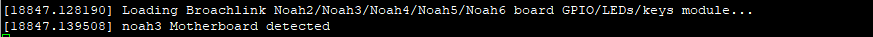

# Linux driver for Broachlink Noah series

## History

Since 2020, **RackMatrix Technology** works with **Broachlink** to build a powerful and reliable alternative to **PC Engines** **APU** boards.

The **Noah** board series is the result of this joint work.

Here is the repository for the LED and push button driver for **Noah** board on Linux made by **Rack Matrix Technology**

## Build

### Requirements

To make this driver, you need the right kernel headers installed and essential build tools.

```
sudo apt-get install linux-headers-$(uname -r)
sudo apt-get install build-essential
```

### Source code

Download the source code

```
git clone https://github.com/rackmatrix/noah-driver.git
```

### Building

```
cd noah-driver
make
sudo make install
```

It will compile without any problem and will get the compiled driver `bl_noah.ko` located in the `build` folder.

### Install 

To install the driver in the system, you can use the `install` **make** target (*root privileges required*). 

```
sudo make install
```

### Install for testing

For one time testing the driver, you can use the `load` **make** target (*root privileges required*).

```
sudo make load
```

You must see on the console the following message, which indicate that the driver detects the **Broachlink** **Noah3** motherboard.



After testing, you can unload the driver using the `unload` **make** target (*root privileges required*).

```
sudo make unload
```

## Usage

Once the driver is loaded and had detected the right motherboard, all devices (LEDs and button) can be found in `/dev/noah`


### Button

To get information from button, you must read the value from `/dev/noah/button`:

- `0` for *unpushed* 
- `1` for *pushed*

#### Read from shell

To read the button state from shell, you can use the following command:

```
cat /dev/noah/button 
```

#### Read from an application

To read the button state from an application, you will have to:
1. Open the file `/dev/noah/button`
2. Read 1 byte from this file

### LEDs

To light on/off the LEDs, you must write the right value in the desired LED file:

- ON: write `ON` or `1` in `/dev/noah/ledX`
- OFF: write `OFF` or `0` in `/dev/noah/ledX`

> Note: Replace `X`with the desired LED number.

#### Usage from shell

```
echo 1 > /dev/noah/led3 
```

```
echo OFF > /dev/noah/led2
```

#### Usage from source code application

Open file `/dev/noah/led3` and write `1` or `ON`

#### Read LEDs status

With this driver, you can get the status of the LED by reading his file: 

- `0`: LED is OFF
- `1`: LED is ON

##### Status from shell

```
cat /dev/noah/led1 
```

##### Status from source code application

Open file `/dev/noah/led1` and read 1 byte.

## Examples

Example code can be found in `examples` folder.

Available languages/frameworks:
- *Anubis (coming soon)*
- **C/C++**
- *C# (coming soon)*
- *Java (coming soon)*
- *TS/NodeJS (coming soon)*
- **Python: uses the library located in the `library` folder.**

## License

GPL-2.0+